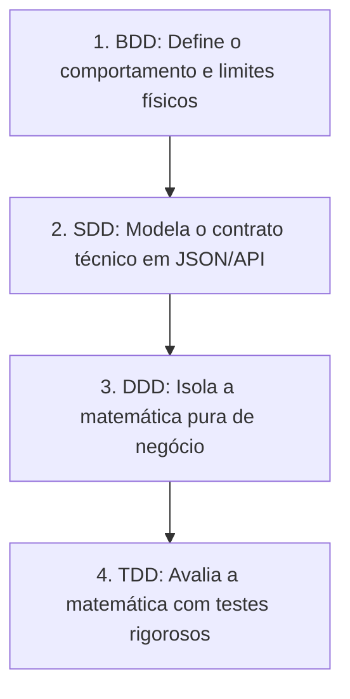

---
tags:
  - arquitetura/engenharia
  - padroes/codigo
  - governanca/ia
versao: 1.0
status: mandatorio
---

# 🏛️ AmpAI: Manifesto de Engenharia Orientada a IA (BDD + SDD + DDD + TDD)

Este documento define a estratégia arquitetural definitiva do projeto AmpAI, integrando **Behavior-Driven Development (BDD)**, **Spec-Driven Development (SDD)**, **Domain-Driven Design (DDD)** e **Test-Driven Development (TDD)**. 

O objetivo principal e inegociável é criar um ambiente com barreiras rígidas para que as ferramentas de Inteligência Artificial (Copilots e Agentes Autônomos) gerem código assertivo, seguro, balizado por normas elétricas internacionais (IEC) e totalmente livre de débitos técnicos.

---

## 1. O Papel de Cada Sigla no Ecossistema de IA

A IA precisa de contexto, limites físicos claros e validação imediata para não "alucinar". As quatro disciplinas se complementam para criar essa cerca de proteção ("Air Gap Lógico"):



*   **BDD (O Comportamento):** Fornece o contexto de negócio. Cenários escritos em formato Gherkin funcionam como *prompts* de alta qualidade e blindados para a IA. O @Engenheiro_Eletricista opera sobre RNC-P/RNC-C em Markdown, classifica a fonte e entrega prova de cálculo contestável antes de qualquer contrato técnico.
*   **SDD (O Contrato):** Define as interfaces de comunicação técnica (ex: Contratos JSON de entrada e saída). Garante que a IA gere payloads estritamente corretos sem inventar variáveis.
*   **DDD (O Design Interno):** Modela o núcleo da regra de negócio (Os motores `core_*.js`). Impede terminantemente que a IA misture lógica de cálculos matemáticos com renderização de interface (DOM).
*   **TDD/CI (A Validação):** Cria a rede de segurança (ZOMBIES). Se o código gerado pela IA falhar nos testes locais, in-browser ou no GitHub Actions, o próprio erro é devolvido ao CTO como evidência para correção. CI é validação reprodutível do Tribunal; não é deploy.

---

## 2. Fluxo de Trabalho e a Esteira de Autocorreção (Loop de Feedback)

O fluxo de desenvolvimento automatizado impede que a IA pule etapas ou foque apenas no caminho feliz (*Happy Path*), algo fatal na engenharia elétrica.

```text
[ FASE 1: ARQUITETURA ]
│
▼
[ FASE 2: CONTEXTO (Docs as Code RAG) ]
│
▼
[ FASE 3: BDD (Comportamento) ]
┌────────────────────────────────────────────────────────┐
│ Engenheiro Eletricista gera BDD + prova contestável    │
└───────┬────────────────────────────────────────────────┘
│
▼
[ FASE 4: TDD RED (ZOMBIES Testes) ]
┌────────────────────────────────────────────────────────┐
│ QA/Codex escreve e executa testes falhos primeiro      │
└───────┬────────────────────────────────────────────────┘
│
▼
[ FASE 5: TDD GREEN (Matemática Pura / DDD) ]
┌────────────────────────────────────────────────────────┐
│ Backend/Claude Code codifica a matemática para passar  │
└───────┬────────────────────────────────────────────────┘
│
▼
[ FASE 6: AUDITORIA / CI DO TRIBUNAL ]
┌────────────────────────────────────────────────────────┐
│ QA/Codex atesta evidências, artifact CI e exit code    │
└───────┬─────────────────────────┬──────────────────────┘
        │ (Rejeitado)             │ (Aprovado)
        ▼                         ▼
┌─────────────────────────┐     ┌────────────────────────┐
│ Loop de Correção Local  │     │ [ FASE 7: ENTREGA ]    │
└─────────────────────────┘     └────────────────────────┘
```

### 🚧 Estratégia Antiararmadilha do Happy Path (Mandatório)
1.  **BDD:** Exige-se da IA pelo menos **3 cenários tristes** para cada cenário feliz (ex: curto-circuito superior à suportabilidade do cabo, correntes nulas, bitolas inexistentes na IEC).
2.  **SDD:** Mapeamento rigoroso das respostas de erro usando padrões de *Problem Details*.
3.  **DDD:** Uso estrito do **Result Pattern**. É **proibido** lançar exceções genéricas ou quebrar o script silenciamente. O motor deve retornar um objeto explícito de falha com as razões técnicas.
4.  **TDD (Framework ZOMBIES):** Aplicação de validações: *Zero, One, Many, Boundary, Interface, Exceptions, Simple*. **A IA deve escrever primeiro os testes de caminhos tristes** antes de implementar a fórmula de sucesso.

---

## 3. Arquitetura e Diretrizes Fundamentais para os Agentes

*   **Verdade Única:** Se o comportamento não está especificado no BDD ou nos contratos SDD, a IA está terminantemente **proibida de codificá-lo**. Invenções ("Hallucinations") são consideradas infrações graves de governança.
*   **RNC antes de dedução:** O Engenheiro Eletricista deve usar Registros Normativos Computáveis em Markdown como fonte operacional. PDF bruto é material de origem, não o formato preferencial de execução.
*   **RNC-P não é RNC-C:** RNC-P é Markdown processado de norma, livro ou guia técnico; RNC-C é documento curado pelo AmpAI com fonte, escopo, equações conferidas, unidades SI, premissas, limites físicos e regras QA. A IA não pode transformar RNC-P em regra de produção sem declarar a promoção para RNC-C.
*   **Caixa Preta de Testes:** Peça primeiro para a IA criar os testes com o objetivo explícito de **tentar quebrar a aplicação** com entradas inválidas, sobrecargas elétricas e limites estourados.
*   **Air Gap Epistemológico:** Fábrica e Tribunal são agentes distintos. A Fábrica não atesta o próprio código; o Tribunal executa testes isoladamente, valida artifacts de CI quando aplicável e devolve a evidência ao CTO. O ciclo encerra apenas com GREEN verificável, PR validado e aprovação humana para merge.
*   **CI não é CD:** GitHub Actions integra o Tribunal QA para gerar logs, artifacts e `exit code` reprodutível. Deploy para staging e produção são etapas futuras, separadas e dependentes de decisão explícita do CEO.

## 4. Gate Consolidado e Proteção Cumulativa

O AmpAI adota uma suíte de regressão cumulativa para features, correções, refatorações, adequações normativas e mudanças de infraestrutura. A lei completa está em `docs/AmpAI_Gate_Regressao.md`.

*   **Manifesto explícito:** somente testes declarados e classificados podem compor o gate; `tests/*.js` não é fonte automática.
*   **Classes distintas:** `stable` bloqueia PR; `experimental` está em validação; `flaky` permanece em quarentena; `archived` preserva história; `utility` não é teste.
*   **Promoção em duas PRs:** teste novo nasce experimental, demonstra RED→GREEN, passa por repetibilidade e execução pós-merge, e só então é promovido para `stable`.
*   **Regressão completa:** todo PR para `main` executará a suíte `stable` integral quando o `regression-gate` for ativado, inclusive PR documental na primeira versão.
*   **Taxonomia rigorosa:** `FUNCTIONAL_FAILURE`, `INFRA_BLOCKED` e `CONFIG_ERROR` bloqueiam a entrega, mas somente falha com contrato exercido é funcional.
*   **Cobertura responsável:** a meta é rastrear todos os contratos críticos conhecidos, não prometer ausência absoluta de falhas nem maximizar porcentagem de linhas sem significado.
*   **Imutabilidade do Tribunal:** nenhuma IA pode flexibilizar, silenciar ou remover teste aprovado para produzir GREEN.
