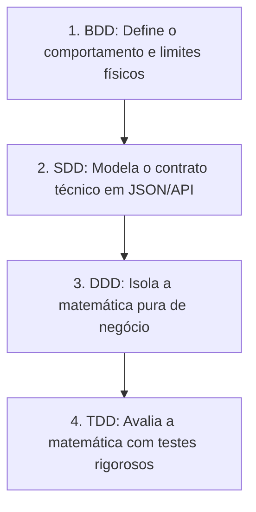

---
tags:
  - arquitetura/engenharia
  - padroes/codigo
  - governanca/ia
versao: 1.0
status: mandatorio
---

# 🏛️ AmpAI: Manifesto de Engenharia Orientada a IA (BDD + SDD + DDD + TDD)

Este documento define a estratégia arquitetural definitiva do projeto AmpAI, integrando **Behavior-Driven Development (BDD)**, **Spec-Driven Development (SDD)**, **Domain-Driven Design (DDD)** e **Test-Driven Development (TDD)**. 

O objetivo principal e inegociável é criar um ambiente com barreiras rígidas para que as ferramentas de Inteligência Artificial (Copilots e Agentes Autônomos) gerem código assertivo, seguro, balizado por normas elétricas internacionais (IEC) e totalmente livre de débitos técnicos.

---

## 1. O Papel de Cada Sigla no Ecossistema de IA

A IA precisa de contexto, limites físicos claros e validação imediata para não "alucinar". As quatro disciplinas se complementam para criar essa cerca de proteção ("Air Gap Lógico"):



*   **BDD (O Comportamento):** Fornece o contexto de negócio. Cenários escritos em formato Gherkin funcionam como *prompts* de alta qualidade e blindados para a IA.
*   **SDD (O Contrato):** Define as interfaces de comunicação técnica (ex: Contratos JSON de entrada e saída). Garante que a IA gere payloads estritamente corretos sem inventar variáveis.
*   **DDD (O Design Interno):** Modela o núcleo da regra de negócio (Os motores `core_*.js`). Impede terminantemente que a IA misture lógica de cálculos matemáticos com renderização de interface (DOM).
*   **TDD (A Validação):** Cria a rede de segurança (ZOMBIES). Se o código gerado pela IA falhar nos testes in-browser ou na VPS, o próprio erro é devolvido para que ela se autocorrija.

---

## 2. Fluxo de Trabalho e a Esteira de Autocorreção (Loop de Feedback)

O fluxo de desenvolvimento automatizado impede que a IA pule etapas ou foque apenas no caminho feliz (*Happy Path*), algo fatal na engenharia elétrica.

```text
[ 1. ENTRADA DE NEGÓCIO ]
│
▼
┌────────────────────────────────────────────────────────┐
│ BDD: Cenários Gherkin (Caminho Feliz + Casos Tristes)  │
└───────┬────────────────────────────────────────────────┘
│
▼
[ 2. CONTRATO DA INTERFACE ]
┌────────────────────────────────────────────────────────┐
│ SDD: Especificação Exata (Variáveis, Limites, JSON)    │
└───────┬────────────────────────────────────────────────┘
│
▼
[ 3. DESIGN DA LOGÍSTICA INTERNA ]
┌────────────────────────────────────────────────────────┐
│ DDD: Lógica Pura Isolada (Result Pattern obrigatório)  │
└───────┬────────────────────────────────────────────────┘
│
▼
[ 4. O MOTOR DA IA ]
┌────────────────────────────────────────────────────────┐
│ ORQUESTRAÇÃO (Fábrica/Claude): Processa os inputs 1,2,3│
└───────┬────────────────────────────────────────────────┘
│
▼
[ 5. CICLO DE VALIDAÇÃO AUTOMATIZADO ]
┌────────────────────────────────────────────────────────┐
│ TDD (ZOMBIES) ──► Execução pelo Tribunal (Antigravity) │
└───────┬─────────────────────────┬──────────────────────┘
        │ (Falhou)                │ (Passou RED->GREEN)
        ▼                         ▼
┌─────────────────────────┐     ┌────────────────────────┐
│ Feedback Loop automático│     │ Deploy Autorizado      │
│ forçando a IA a refazer │     │ Merge no GitHub        │
└─────────────────────────┘     └────────────────────────┘
```

### 🚧 Estratégia Antiararmadilha do Happy Path (Mandatório)
1.  **BDD:** Exige-se da IA pelo menos **3 cenários tristes** para cada cenário feliz (ex: curto-circuito superior à suportabilidade do cabo, correntes nulas, bitolas inexistentes na IEC).
2.  **SDD:** Mapeamento rigoroso das respostas de erro usando padrões de *Problem Details*.
3.  **DDD:** Uso estrito do **Result Pattern**. É **proibido** lançar exceções genéricas ou quebrar o script silenciamente. O motor deve retornar um objeto explícito de falha com as razões técnicas.
4.  **TDD (Framework ZOMBIES):** Aplicação de validações: *Zero, One, Many, Boundary, Interface, Exceptions, Simple*. **A IA deve escrever primeiro os testes de caminhos tristes** antes de implementar a fórmula de sucesso.

---

## 3. Arquitetura e Diretrizes Fundamentais para os Agentes

*   **Verdade Única:** Se o comportamento não está especificado no BDD ou nos contratos SDD, a IA está terminantemente **proibida de codificá-lo**. Invenções ("Hallucinations") são consideradas infrações graves de governança.
*   **Caixa Preta de Testes:** Peça primeiro para a IA criar os testes com o objetivo explícito de **tentar quebrar a aplicação** com entradas inválidas, sobrecargas elétricas e limites estourados.
*   **Loops Sem Intervenção Humana (Air Gap):** Os Agentes conectados ao terminal (Fábrica vs Tribunal) usarão o log de erro do TDD para retroalimentar os seus próprios *prompts* num loop infinito, encerrando-se **apenas** quando o código passar em 100% dos testes sem margem para dúvidas.
