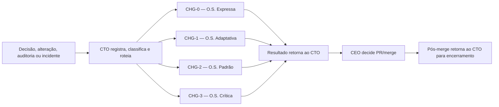
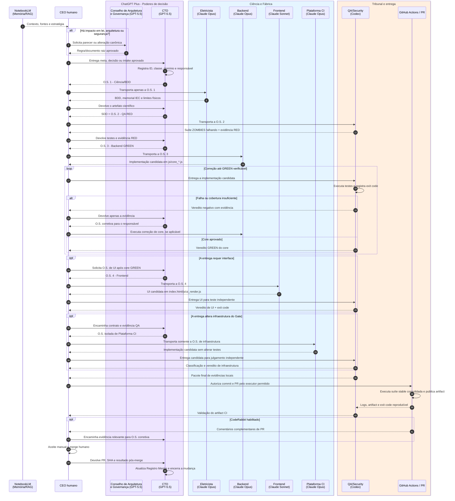

# ⚙️ Ciclo de Vida de uma Ordem de Serviço

> **Propósito:** transformar uma meta aprovada em uma entrega verificável sem misturar memória, legislação, orquestração, implementação e julgamento.

## Mapa visual do fluxo

Toda demanda entra primeiro na Torre de Controle do CTO. A classificação canônica está em `docs/AmpAI_Classificacao_Mudancas.md`.



O diagrama sequencial abaixo representa a cadeia completa típica de `CHG-2`/`CHG-3`. `CHG-0` e `CHG-1` usam apenas os participantes e controles exigidos pela classe e pelo domínio.



---

## Faixas de responsabilidade

| Faixa | Responsável | Produz | Não pode fazer |
| --- | --- | --- | --- |
| Memória | NotebookLM | contexto, fontes e hipóteses estratégicas | escrever código de produção ou O.S. |
| Conselho independente | @Conselho_de_Arquitetura_e_Governanca | leis, auditorias, ratificações arquiteturais e documentos raiz | emitir O.S. ou implementar a solução |
| Executivo / Torre de Controle | @CTO | Registro Mestre, classificação CHG-0 a CHG-3, SDD, critérios de aceite, roteamento e O.S. proporcional | alterar leis, executar a Fábrica, substituir veredito ou fazer merge |
| Ciência | @Engenheiro_Eletricista | BDD, classificação RNC-P/RNC-C, memorial, prova de cálculo contestável, premissas IEC e faixas físicas | implementar o código final |
| Fábrica | @Senior_Backend_Dev / @Senior_Frontend_Dev | core DDD ou UI, cada qual no próprio escopo | julgar a própria entrega |
| Fábrica de Plataforma | @Engenheiro_Plataforma_CI | workflows, executores, schemas, comandos e artifacts conforme O.S. | escrever testes, decidir classificações, emitir veredito ou operar CD |
| Tribunal | @Senior_QA_Security | testes ZOMBIES, resultado da execução local/CI, artifacts, mutation testing aplicável e `exit code` | implementar a correção avaliada |
| Soberania | CEO | direção, autorização de PR e merge | delegar o merge a uma IA |

## Etapas operacionais

### 0. Estratégia e governança

O CEO consulta o NotebookLM para recuperar contexto. Se a demanda mudar uma lei de engenharia, segurança, arquitetura, dados ou a própria metodologia, ela passa primeiro pelo Conselho de Arquitetura e Governança. A decisão do Conselho retorna obrigatoriamente ao CTO para registro, análise de impacto e decomposição. Nos demais casos, a demanda entra diretamente no CTO.

**Saída obrigatória do Conselho, quando acionado:** decisão registrada e atualização do documento canônico correspondente. O Conselho não cria a O.S. de implementação. A denominação histórica `@Arquiteto_Chefe_e_Governanca` permanece válida apenas nos selos emitidos antes da v7.1.

### 1. Intake, classificação e planejamento executivo

O CTO recebe toda meta, decisão, alteração, auditoria, falha ou incidente. Antes de encaminhar trabalho, registra a entrada em `docs/AmpAI_Registro_Mudancas.md`, classifica como `CHG-0`, `CHG-1`, `CHG-2` ou `CHG-3` e cria uma O.S. proporcional por destinatário. Para uma nova regra elétrica, a primeira O.S. é sempre científica/BDD; após receber o artefato científico, o CTO consolida o contrato SDD em `docs/api/` e emite a O.S. de QA.

- `CHG-0 — Expressa`: não comportamental; escopo, responsável e verificação mínima.
- `CHG-1 — Adaptativa`: preserva contrato; teste direcionado, regressão `stable` para código e QA proporcional.
- `CHG-2 — Padrão`: altera comportamento; SDD/critério, RED experimental, GREEN e QA independente.
- `CHG-3 — Crítica`: ciência, segurança, dados, Plataforma, infraestrutura ou lei; controles completos dos especialistas relevantes.

O CTO é o único orquestrador lógico. O CEO pode transportar material entre threads isoladas quando a ferramenta exigir, mas não precisa decidir a rota, redigir prompts técnicos ou acompanhar o detalhe operacional.

Cada O.S. deve conter:

1. identificador, objetivo e persona destinatária;
2. arquivos permitidos e arquivos proibidos;
3. entradas, saídas e contrato SDD aplicável;
4. links ou trechos mínimos de BDD/norma necessários, com classificação da fonte como RNC-P, RNC-C, norma primária ou referência secundária;
5. critérios objetivos de aceite e evidências exigidas;
6. regra explícita de retorno ao CTO em caso de falha.
7. teste novo classificado inicialmente como `experimental`, vínculo com o contrato e regressões `stable` que devem permanecer verdes.
8. classe da mudança, domínio e justificativa de proporcionalidade.

### 2. Ciência e especificação (BDD + SDD)

O @Engenheiro_Eletricista consome Registros Normativos Computáveis em Markdown e classifica cada fonte antes da dedução. **RNC-P** é fonte processada de consulta; **RNC-C** é base canônica curada. Somente RNC-C ou norma primária validada pode sustentar comportamento de produção sem ressalva. O Engenheiro converte a base aprovada em cenários Gherkin, memorial LaTeX, premissas declaradas, prova de cálculo contestável e tabela de limites físicos. O CEO devolve esse artefato ao CTO, que transforma o comportamento em contrato técnico SDD e mapeia erros como RFC 7807.

A taxonomia oficial está em `docs/AmpAI_RNC_Taxonomia.md`.

**Gate para seguir:** BDD contém caminho feliz e pelo menos três caminhos tristes por regra relevante; entradas físicas inválidas estão explicitamente bloqueadas; toda regra física declara se veio de RNC-P, RNC-C, norma primária ou referência secundária. Regra derivada apenas de RNC-P deve ser promovida para RNC-C antes de virar implementação.

### 3. Tribunal RED (ZOMBIES)

O @Senior_QA_Security recebe a O.S. de QA, não a implementação. Ele cria a suíte de testes em `tests/` para provar que a capacidade ainda não existe ou que falha diante de limites, interfaces e exceções.

**Gate para seguir:** a evidência RED mostra que o teste falha pelo motivo esperado. Um teste que já passa sem a implementação não comprova a barreira pretendida.

Todo teste novo nasce como `experimental`. Ele não integra automaticamente o gate obrigatório, mesmo depois do primeiro GREEN. Classificação, repetibilidade e promoção seguem `docs/AmpAI_Gate_Regressao.md`.

Esta etapa é obrigatória para `CHG-2`/`CHG-3` com comportamento novo ou corrigido. `CHG-1` que preserve comportamento usa testes existentes ou caracterização quando houver lacuna; é proibido criar RED artificial apenas para cumprir rito.

### 4. Fábrica GREEN (DDD)

O @Senior_Backend_Dev recebe apenas BDD, SDD, testes RED e a O.S. de backend. Implementa nos arquivos `js/core_*.js`, com validação fail-fast, Result Pattern e RFC 7807; não toca o DOM. O código retorna ao Tribunal, nunca é autoaprovado pela Fábrica.

**Gate para seguir:** QA executa de forma independente o teste novo e as regressões `stable` relacionadas, registrando GREEN com `exit code` zero. Falhas voltam ao CTO como evidência, e não como pedido genérico de “conserte”.

### 5. Interface, quando necessária

Somente após o core estar GREEN o CTO emite O.S. de interface. O @Senior_Frontend_Dev atua em `index.html`, Tailwind e `js/ui_render.js`; usa guards de nulidade, delegação de eventos e atributos estáveis para teste. A UI volta ao Tribunal para testes L0/funcionais aplicáveis.

**Gate para seguir:** o resultado do core é exibido sem duplicar fórmulas ou regras IEC no frontend, e os testes definidos para UI concluem com `exit code` zero.

### 5.1 Plataforma CI, quando necessária

Quando a entrega exigir alteração em `.github/workflows/**`, `scripts/qa/**`, infraestrutura em `qa/**`, scripts npm do Gate ou artifacts, o CTO emite O.S. exclusiva para o @Engenheiro_Plataforma_CI. A entrada deve conter o contrato de infraestrutura e a evidência do QA; `CONFIG_ERROR` esperado pode representar RED de infraestrutura, mas nunca RED funcional.

O agente de Plataforma não edita `tests/**`. `qa/test-manifest.json` só pode ser materializado quando a O.S. reproduzir decisão explícita do QA sobre classificação, contrato e contagem. A candidata sempre retorna ao QA independente.

**Gate para seguir:** o QA confirma que o contrato foi exercido, que testes e classificações não foram flexibilizados e que o resultado foi corretamente separado entre `PASS`, `FUNCTIONAL_FAILURE`, `INFRA_BLOCKED` e `CONFIG_ERROR`.

### 6. PR, CI, revisão complementar e merge

O CEO só autoriza commit/PR após receber o pacote final de evidências locais. O executor de Git utilizado deve ser autorizado pelo CEO e respeitar as permissões do ambiente.

Todo PR para `main` deverá acionar o Gate Consolidado de Regressão quando sua infraestrutura for ativada. O required check estável será `regression-gate`: executará todos os testes explicitamente classificados como `stable`, separando core e browser, e bloqueará qualquer resultado diferente de `PASS`. Testes `experimental`, `flaky`, `archived` ou `utility` não podem entrar silenciosamente no gate.

Durante a transição, os workflows atuais permanecem como evidência oficial até o novo gate completar shadow mode, comparação independente e autorização do CEO. A arquitetura, promoção em duas PRs, taxonomia de falhas e política de artifacts estão em `docs/AmpAI_Gate_Regressao.md`.

GitHub Actions é parte oficial do Tribunal: captura logs, publica artifacts e devolve resultado reprodutível ao @Senior_QA_Security. `INFRA_BLOCKED` e `CONFIG_ERROR` bloqueiam o PR, mas não constituem RED/GREEN funcional. O QA valida o artifact e só então a entrega permanece elegível para aceite.

O CodeRabbit, se habilitado, adiciona revisão complementar no PR: comentários técnicos relevantes retornam ao CTO como evidência para uma O.S. corretiva. Ele não substitui o Tribunal Codex, o artifact de CI nem o CEO.

O merge é exclusivamente humano, depois de aceite funcional/manual e revisão das evidências.

Documentação editorial `CHG-0` não exige regressão funcional. Durante a implementação transitória atual, o workflow shadow pode executar a suíte completa também em PR documental; otimização por caminhos depende de O.S. específica para Plataforma CI e validação independente.

---

## Formato mínimo da evidência de QA

```text
O.S.: <identificador>
Fase avaliada: RED | GREEN | UI
Escopo testado: <arquivos e comportamento>
Comando executado: <comando exato>
Ambiente: local | GitHub Actions
Artifact CI: não aplicável | <nome/link do artifact>
Resultado: PASS | FUNCTIONAL_FAILURE | INFRA_BLOCKED | CONFIG_ERROR
Exit code: <inteiro>
Mutation testing: não aplicável | <ferramenta e resultado>
Falhas relevantes: <lista ou "nenhuma">
Veredito: BLOQUEADO | APROVADO PARA A PR
```

## Leis invioláveis

1. **Uma persona, um chat/thread.** O CTO é o único orquestrador lógico; o CEO pode atuar apenas como transporte mecânico entre contextos quando necessário.
2. **Quem escreve não julga.** Fábrica e Tribunal são independentes.
3. **RED precede GREEN.** Não há implementação sem testes de fronteira e exceção previamente definidos.
4. **Core não toca DOM.** UI não replica fórmula ou decisão normativa.
5. **Sem evidência, sem PR; sem CI/artifact quando aplicável; sem CEO, sem merge.**
6. **Stable é cumulativo.** Todo PR para `main` preserva todos os contratos `stable`; teste novo só entra no gate após promoção formal.
7. **Infraestrutura não é comportamento.** Falha de Chromium, sandbox, runner ou bootstrap bloqueia a entrega, mas nunca pode ser declarada RED/GREEN funcional.
8. **Teste aprovado não é moeda de troca.** Nenhuma IA pode removê-lo, arquivá-lo ou enfraquecê-lo para liberar implementação.
9. **Plataforma materializa; QA decide.** O executor do CI não escreve o teste avaliado, não escolhe sua classificação e não atesta a própria correção.
10. **Tudo passa pelo CTO; nem tudo passa pela cadeia máxima.** Toda mudança é registrada e classificada antes da execução, com controles proporcionais ao risco.
