# O Ciclo de Vida de uma OS (Governança v7.0 - TDD Purista)

Este é o fluxo de produção de software de ponta a ponta do AmpAI. Ele garante que nenhuma linha de código vá para produção sem passar por uma rigorosa validação cruzada entre inteligências artificiais. A metodologia adota o TDD (Test-Driven Development) rigoroso.

```mermaid
sequenceDiagram
    participant CEO as Você (CEO)
    participant CTO as Antigravity (Arquiteto)
    participant Claude as Claude Code (Engenheiro/QA)
    participant CodeRabbit as CodeRabbit (Auditor Nuvem)
    
    %% Fase 1: Planejamento
    rect rgb(20, 40, 60)
        Note over CEO, CTO: FASE 1: ARQUITETURA
        CEO->>CTO: "Quero a feature X (Ex: Curto-Circuito)"
        CTO->>CTO: Desenha Arquitetura e BDDs
        CTO-->>CEO: Entrega as OS prontas (Prompts Exatos)
    end
    
    %% Fase 2: RAG e Ingestão
    rect rgb(20, 60, 40)
        Note over CEO, Claude: FASE 2: CONTEXTO (Docs as Code)
        CEO->>Claude: Salva norma em docs/normas/
        CEO->>CEO: Roda sync.ps1 (Alimenta Google Drive/NotebookLM)
    end
    
    %% Fase 3: TDD Fase Red (Testes)
    rect rgb(80, 20, 20)
        Note over CEO, Claude: FASE 3: TDD RED (Testes ZOMBIES)
        CEO->>Claude: Cola a [OS de Testes] no terminal local
        Claude->>Claude: Lê .Senior QA-Security.txt
        Claude-->>CEO: Escreve testes unitários (Falhando)
    end

    %% Fase 4: TDD Fase Green (Matemática)
    rect rgb(20, 80, 20)
        Note over CEO, Claude: FASE 4: TDD GREEN (Implementação)
        CEO->>Claude: Cola a [OS Matemática] no terminal local
        Claude->>Claude: Lê .Engenheiro Eletricista.txt
        Claude->>Claude: Lê docs/normas/...
        Claude-->>CEO: Escreve o código (js/core_curto_circuito.js) para passar
    end
    
    %% Fase 5: Auditoria em Nuvem
    rect rgb(60, 20, 40)
        Note over CEO, CodeRabbit: FASE 5: AUDITORIA (CI/CD)
        CEO->>CodeRabbit: Git Push & Pull Request no GitHub
        CodeRabbit->>CodeRabbit: Lê .coderabbit.yaml (Regras ZOMBIES)
        CodeRabbit->>CodeRabbit: Inspeciona as fórmulas e limites físicos
        alt Encontrou erro
            CodeRabbit-->>Claude: "Rejeitado: Faltou blindagem na linha 42"
            Claude->>Claude: Corrige o código localmente
        else Tudo Perfeito
            CodeRabbit-->>CEO: "Aprovado: Código Seguro"
        end
    end
    
    %% Fase 6: Entrega
    CEO->>CEO: Merge para a Branch Main (Produção)
```

### Resumo dos Papéis na Linha de Montagem:

1. **O Arquiteto (Antigravity):** Pensa, desenha a estrutura das pastas, dita as regras e cria o comando exato (A Ordem de Serviço).
2. **O Gestor de Conhecimento (Você + sync.ps1):** Garante que os arquivos da Norma (`.md`) estejam na pasta correta e sincronizados.
3. **O Operário TDD (Claude Code CLI):** 
    - **Fase QA (Red):** Cria os testes bloqueadores primeiro.
    - **Fase Engenheiro (Green):** Escreve as equações da IEC 60909 baseadas na Norma para fazer o teste passar.
4. **O Inspetor de Qualidade (CodeRabbit):** Fica na nuvem do GitHub. Analisa se o Operário (Claude) não cometeu nenhum erro de física ou deixou brechas de divisão por zero na PR.
5. **O Dono da Empresa (Você / CEO):** Apenas dá os comandos, observa as IAs trabalharem e aperta o botão verde final de *Merge* no GitHub para lançar o produto.
