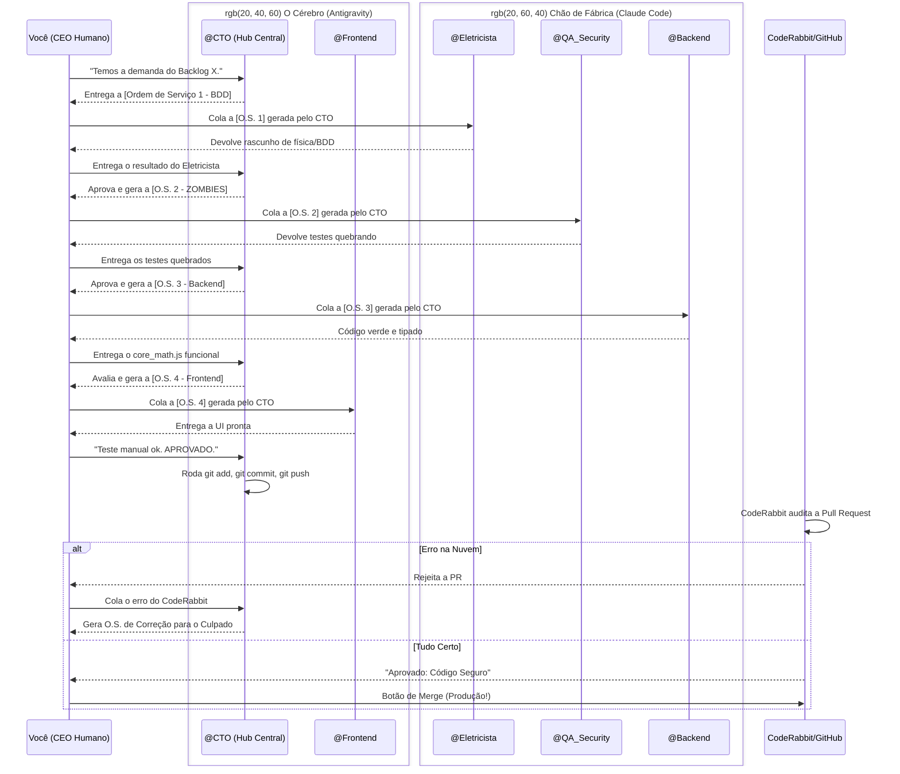

# O Ciclo de Vida de uma OS (Governança v7.0 - Hub-and-Spoke)

A operação de software da AmpAI segue uma arquitetura **Hub-and-Spoke (Estrela)**. O @CTO atua como o cérebro central (Hub) e os outros agentes como executores especialistas (Spokes). O CEO Humano não "pensa" em prompts, atua puramente como Gatekeeper e Transportador.

---

### A Dinâmica "Hub-and-Spoke" (O Papel do CTO)

Para que nenhuma IA sofra de "alucinação" por excesso de contexto e o CEO humano não sofra "fadiga de decisão", todo o ciclo de vida de uma *feature* é orquestrado de um ponto central: A aba isolada do **@CTO** no Antigravity.

#### O Roteiro Padrão de Execução:
1. **O Gatilho:** Você avisa o CTO qual feature será feita.
2. **A Ordem:** O CTO elabora a "Ordem de Serviço (Prompt)" perfeita, contendo apenas as informações que o Engenheiro Eletricista precisa saber. Nenhuma palavra a mais.
3. **O Ping:** Você copia essa Ordem de Serviço, vai na aba isolada do Eletricista e cola.
4. **O Pong:** O Eletricista te dá a física pronta. Você não precisa ler nem julgar a física. Você apenas copia o resultado e devolve para o CTO.
5. **O Ciclo se Repete:** O CTO lê a física, valida se atende a arquitetura, e elabora a O.S. para o QA. Você atua como carteiro, levando o prompt até a aba do QA, e trazendo a resposta de volta ao CTO.

#### A Diferença entre `git push` (CTO) e `Merge` (CEO):
- Após a UI ficar pronta, você testa o sistema. Se estiver visualmente e funcionalmente ok, você diz ao CTO: **"APROVADO"**.
- Como o Antigravity possui acesso ao terminal, o CTO executará o comando de `git push` criando a Pull Request.
- **O Gatekeeper Final:** A nuvem (CodeRabbit) faz a auditoria matemática do PR criado pelo CTO. Somente o **CEO (Você)** tem o poder de abrir o GitHub pelo navegador e clicar no botão verde de **Merge**. Uma máquina não pode jogar código diretamente em produção sem a bênção final de um humano.
