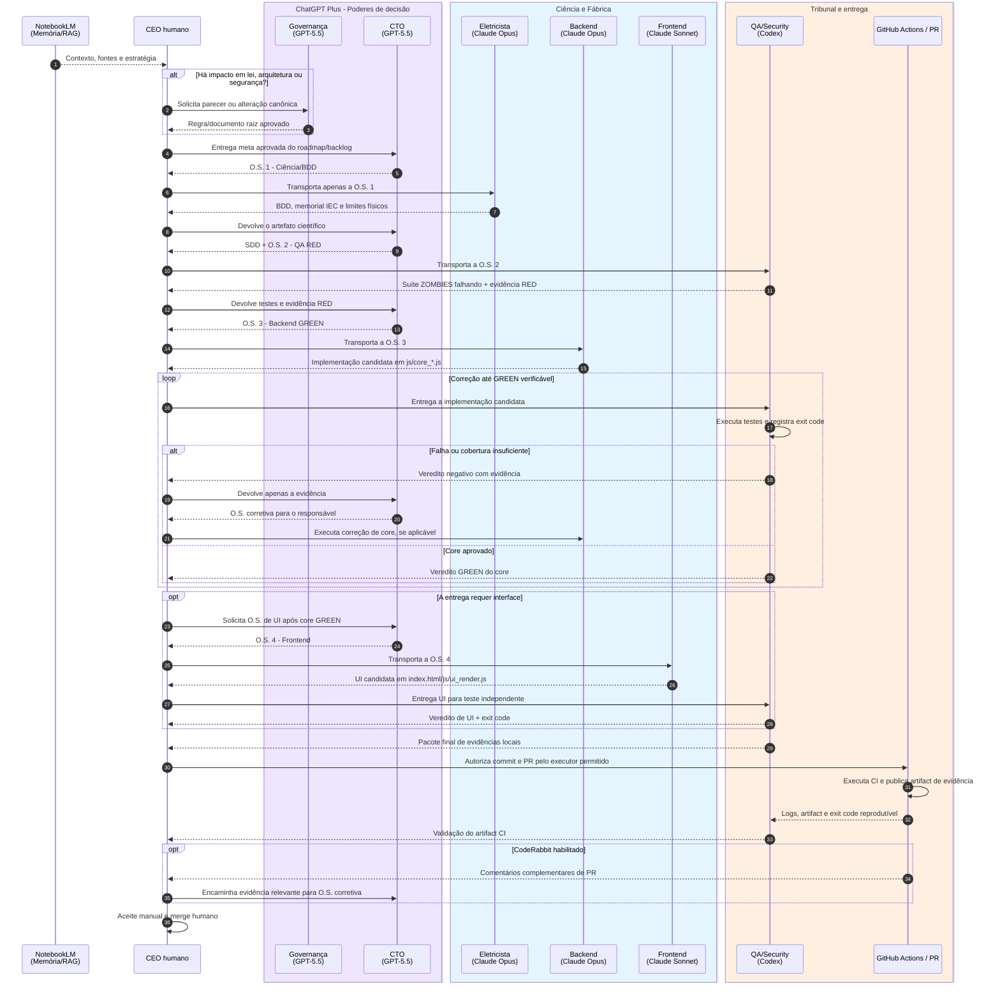

# ⚙️ Ciclo de Vida de uma Ordem de Serviço

> **Propósito:** transformar uma meta aprovada em uma entrega verificável sem misturar memória, legislação, orquestração, implementação e julgamento.

## Mapa visual do fluxo



---

## Faixas de responsabilidade

| Faixa | Responsável | Produz | Não pode fazer |
| --- | --- | --- | --- |
| Memória | NotebookLM | contexto, fontes e hipóteses estratégicas | escrever código de produção ou O.S. |
| Legislativo/Judiciário | @Arquiteto_Chefe_e_Governanca | leis, auditorias, decisões arquiteturais e documentos raiz | emitir O.S. ou implementar a solução |
| Executivo | @CTO | SDD, critérios de aceite e uma O.S. por especialista | alterar as leis de Governança ou atestar o próprio fluxo |
| Ciência | @Engenheiro_Eletricista | BDD, classificação RNC-P/RNC-C, memorial, prova de cálculo contestável, premissas IEC e faixas físicas | implementar o código final |
| Fábrica | @Senior_Backend_Dev / @Senior_Frontend_Dev | core DDD ou UI, cada qual no próprio escopo | julgar a própria entrega |
| Tribunal | @Senior_QA_Security | testes ZOMBIES, resultado da execução local/CI, artifacts, mutation testing aplicável e `exit code` | implementar a correção avaliada |
| Soberania | CEO | direção, autorização de PR e merge | delegar o merge a uma IA |

## Etapas operacionais

### 0. Estratégia e governança

O CEO consulta o NotebookLM para recuperar contexto. Se a demanda mudar uma lei de engenharia, segurança, arquitetura, dados ou a própria metodologia, ela passa primeiro por Governança. Caso contrário, a meta vai diretamente ao CTO.

**Saída obrigatória da Governança, quando acionada:** decisão registrada e atualização do documento canônico correspondente. Governança não cria a O.S. de implementação.

### 1. Planejamento executivo

O CTO recebe somente a meta aprovada e cria uma O.S. específica por destinatário. Para uma nova regra elétrica, a primeira O.S. é sempre científica/BDD; após receber o artefato científico, o CTO consolida o contrato SDD em `docs/api/` e emite a O.S. de QA.

Cada O.S. deve conter:

1. identificador, objetivo e persona destinatária;
2. arquivos permitidos e arquivos proibidos;
3. entradas, saídas e contrato SDD aplicável;
4. links ou trechos mínimos de BDD/norma necessários, com classificação da fonte como RNC-P, RNC-C, norma primária ou referência secundária;
5. critérios objetivos de aceite e evidências exigidas;
6. regra explícita de retorno ao CTO em caso de falha.

### 2. Ciência e especificação (BDD + SDD)

O @Engenheiro_Eletricista consome Registros Normativos Computáveis em Markdown e classifica cada fonte antes da dedução. **RNC-P** é fonte processada de consulta; **RNC-C** é base canônica curada. Somente RNC-C ou norma primária validada pode sustentar comportamento de produção sem ressalva. O Engenheiro converte a base aprovada em cenários Gherkin, memorial LaTeX, premissas declaradas, prova de cálculo contestável e tabela de limites físicos. O CEO devolve esse artefato ao CTO, que transforma o comportamento em contrato técnico SDD e mapeia erros como RFC 7807.

A taxonomia oficial está em `docs/AmpAI_RNC_Taxonomia.md`.

**Gate para seguir:** BDD contém caminho feliz e pelo menos três caminhos tristes por regra relevante; entradas físicas inválidas estão explicitamente bloqueadas; toda regra física declara se veio de RNC-P, RNC-C, norma primária ou referência secundária. Regra derivada apenas de RNC-P deve ser promovida para RNC-C antes de virar implementação.

### 3. Tribunal RED (ZOMBIES)

O @Senior_QA_Security recebe a O.S. de QA, não a implementação. Ele cria a suíte de testes em `tests/` para provar que a capacidade ainda não existe ou que falha diante de limites, interfaces e exceções.

**Gate para seguir:** a evidência RED mostra que o teste falha pelo motivo esperado. Um teste que já passa sem a implementação não comprova a barreira pretendida.

### 4. Fábrica GREEN (DDD)

O @Senior_Backend_Dev recebe apenas BDD, SDD, testes RED e a O.S. de backend. Implementa nos arquivos `js/core_*.js`, com validação fail-fast, Result Pattern e RFC 7807; não toca o DOM. O código retorna ao Tribunal, nunca é autoaprovado pela Fábrica.

**Gate para seguir:** QA executa a suíte de forma independente e registra GREEN com `exit code` zero. Falhas voltam ao CTO como evidência, e não como pedido genérico de “conserte”.

### 5. Interface, quando necessária

Somente após o core estar GREEN o CTO emite O.S. de interface. O @Senior_Frontend_Dev atua em `index.html`, Tailwind e `js/ui_render.js`; usa guards de nulidade, delegação de eventos e atributos estáveis para teste. A UI volta ao Tribunal para testes L0/funcionais aplicáveis.

**Gate para seguir:** o resultado do core é exibido sem duplicar fórmulas ou regras IEC no frontend, e os testes definidos para UI concluem com `exit code` zero.

### 6. PR, CI, revisão complementar e merge

O CEO só autoriza commit/PR após receber o pacote final de evidências locais. O executor de Git utilizado deve ser autorizado pelo CEO e respeitar as permissões do ambiente.

Para a branch `Refat_Frontend`, o PR para `main` deve acionar GitHub Actions antes do merge. Esse CI é parte oficial do Tribunal: roda os testes definidos, captura logs, publica artifact e devolve `exit code` reprodutível ao @Senior_QA_Security. O QA valida o artifact e só então a entrega permanece elegível para aceite.

O CodeRabbit, se habilitado, adiciona revisão complementar no PR: comentários técnicos relevantes retornam ao CTO como evidência para uma O.S. corretiva. Ele não substitui o Tribunal Codex, o artifact de CI nem o CEO.

O merge é exclusivamente humano, depois de aceite funcional/manual e revisão das evidências.

---

## Formato mínimo da evidência de QA

```text
O.S.: <identificador>
Fase avaliada: RED | GREEN | UI
Escopo testado: <arquivos e comportamento>
Comando executado: <comando exato>
Ambiente: local | GitHub Actions
Artifact CI: não aplicável | <nome/link do artifact>
Resultado: PASS | FAIL
Exit code: <inteiro>
Mutation testing: não aplicável | <ferramenta e resultado>
Falhas relevantes: <lista ou "nenhuma">
Veredito: BLOQUEADO | APROVADO PARA A PR
```

## Leis invioláveis

1. **Uma persona, um chat/thread.** O CEO é o único transportador entre contextos.
2. **Quem escreve não julga.** Fábrica e Tribunal são independentes.
3. **RED precede GREEN.** Não há implementação sem testes de fronteira e exceção previamente definidos.
4. **Core não toca DOM.** UI não replica fórmula ou decisão normativa.
5. **Sem evidência, sem PR; sem CI/artifact quando aplicável; sem CEO, sem merge.**
