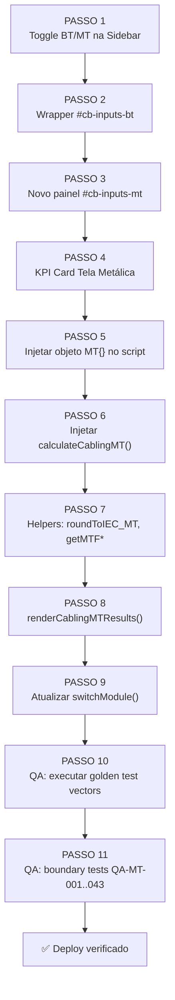

# 🛠️ ESPECIFICAÇÃO TÉCNICA E ARQUITETURA DE SOFTWARE
## Módulo: Dimensionamento de Cabos de Média Tensão (MT) — IEC 60502-2

> **Módulo:** Cabos MT — AmpAI  
> **Revisão:** 1.0  
> **Data:** 2026-05-28  
> **Autor:** CTO / Arquiteto de Software  
> **Base Científica:** [IEC_60502_2_Premissas_MT.md](file:///c:/Users/ACER/Desktop/Programing/Programas/AmpAI/docs/engenharia/IEC_60502_2_Premissas_MT.md) — Engenheiro Eletricista Sênior  
> **Classificação:** Especificação de Software — Contrato de Dados Homologado

---

## Sumário

1. [Decisão de Arquitetura e Stack](#1-decisão-de-arquitetura-e-stack)
2. [Contrato de Estrutura de Dados (JSON)](#2-contrato-de-estrutura-de-dados-json)
3. [Diretrizes de Execução para o Hermes Runtime](#3-diretrizes-de-execução-para-o-hermes-runtime)

---

## 1. Decisão de Arquitetura e Stack

### 1.1 Estratégia de Integração no DOM

O módulo de MT **não** será um módulo SPA independente. Ele será integrado **dentro** do módulo de cabos existente (`#module-cabling`) como uma **sub-aba** de seleção de tensão (BT vs. MT), aproveitando toda a infraestrutura de layout já consolidada.

> [!IMPORTANT]
> **Decisão arquitetural crítica:** O módulo de MT reutiliza o container `#module-cabling` existente. A razão é manter um ponto de entrada único "Dimensionamento de Cabos" na navegação lateral, evitando fragmentação de UX. A alternância BT/MT será feita por um toggle no topo da sidebar.

#### Hierarquia DOM proposta

```
#module-cabling (display: contents | none)
├── aside.sidebar #cb-sidebar
│   ├── [NOVO] Toggle BT/MT ─── #cb-voltage-level-toggle
│   │   ├── button#cb-toggle-bt  "BT (≤ 1kV)"    ← ativa painel BT existente
│   │   └── button#cb-toggle-mt  "MT (6–30kV)"    ← ativa painel MT novo
│   ├── [EXISTENTE] div#cb-inputs-bt (todos os inputs BT atuais)
│   └── [NOVO] div#cb-inputs-mt (style="display:none")
│       ├── Grupo 1: Sistema MT (Classe U₀/U, Aterramento)
│       ├── Grupo 2: Condutor (Material, Isolação, Ib, cos φ)
│       ├── Grupo 3: Circuito (Comprimento, ΔU max)
│       ├── Grupo 4: Instalação (Formação, Solo, Profundidade, Agrupamento)
│       ├── Grupo 5: Proteção & Curto-Circuito (Icc, t, tela)
│       └── Grupo 6: Dicionário de Símbolos MT
├── main.dashboard #cb-dashboard
│   ├── [EXISTENTE] KPI Cards (4 cards reutilizados)
│   ├── [NOVO] KPI Card 5: Seção da Tela Metálica ← MT only
│   ├── [EXISTENTE] Tabs Header + Tab Content
│   │   ├── [NOVO] Tab: Verificações MT
│   │   ├── [NOVO] Tab: Memorial MT
│   │   └── [REUTILIZADO] Tab: Gráfico (com dados MT)
│   └── [EXISTENTE] Accordion Memorial
```

#### Regra de visibilidade JS

```javascript
// Estado global do voltage level
let cbVoltageLevel = 'BT'; // 'BT' ou 'MT'

function setCablingVoltageLevel(level) {
    cbVoltageLevel = level;
    document.getElementById('cb-toggle-bt').classList.toggle('active', level === 'BT');
    document.getElementById('cb-toggle-mt').classList.toggle('active', level === 'MT');
    document.getElementById('cb-inputs-bt').style.display = level === 'BT' ? 'block' : 'none';
    document.getElementById('cb-inputs-mt').style.display = level === 'MT' ? 'block' : 'none';
    // Dispara o motor correto
    level === 'BT' ? calculateCabling() : calculateCablingMT();
}
```

---

### 1.2 Inputs da Interface MT (Sidebar)

Todos os inputs utilizam as classes CSS existentes do design system (`form-control`, `input-wrapper`, `unit-badge`, `toggle-btn-group`) — **zero novas dependências CSS**.

#### Grupo 1 — Sistema de Média Tensão

| Input HTML | ID | Tipo | Valores | Default | Unidade |
|:---|:---|:---|:---|:---:|:---:|
| Classe de Tensão $U_0/U$ | `mt-voltage-class` | `<select>` | `"3.6/6"`, `"6/10"`, `"8.7/15"`, `"12/20"`, `"18/30"` | `"12/20"` | kV |
| Tipo de Aterramento | `mt-earthing` | `<select>` | `"solid"`, `"resistance"`, `"isolated"` | `"solid"` | — |
| Corrente de Falta à Terra | `mt-i-fault` | `<input number>` | $10$–$50\,000$ | `5000` | A |

#### Grupo 2 — Condutor

| Input HTML | ID | Tipo | Valores | Default | Unidade |
|:---|:---|:---|:---|:---:|:---:|
| Material do Condutor | `mt-conductor` | Toggle | `"Cu"`, `"Al"` | `"Cu"` | — |
| Tipo de Isolação | `mt-insulation` | Toggle | `"XLPE"`, `"EPR"` | `"XLPE"` | — |
| Corrente de Projeto ($I_b$) | `mt-ib` | `<input number>` | $1$–$1600$ | `250` | A |
| Fator de Potência ($\cos\varphi$) | `mt-cosphi` | `<input number>` | $0{,}70$–$1{,}00$ | `0.92` | — |

#### Grupo 3 — Circuito

| Input HTML | ID | Tipo | Valores | Default | Unidade |
|:---|:---|:---|:---|:---:|:---:|
| Tensão Fase-Fase ($U_{LL}$) | `mt-ull` | `<input number>` (auto-filled pelo select) | — | `20000` | V |
| Comprimento do Cabo ($L$) | `mt-length` | `<input number>` | $1$–$50\,000$ | `500` | m |
| Queda de Tensão Máx. ($\Delta u_{\max}$) | `mt-du-max` | `<input number>` | $0{,}5$–$8{,}0$ | `5.0` | % |

#### Grupo 4 — Instalação (Enterrado)

| Input HTML | ID | Tipo | Valores | Default | Unidade |
|:---|:---|:---|:---|:---:|:---:|
| Formação dos Cabos | `mt-formation` | `<select>` | `"trefoil_touching"`, `"trefoil_spaced"`, `"flat_touching"`, `"flat_spaced"` | `"trefoil_touching"` | — |
| Nº de Circuitos Agrupados | `mt-n-circuits` | `<input number>` | $1$–$20$ | `1` | — |
| Resistividade Térmica do Solo ($\rho_{solo}$) | `mt-rho-soil` | `<input number>` | $0{,}5$–$5{,}0$ | `1.5` | K·m/W |
| Profundidade de Instalação ($D$) | `mt-depth` | `<input number>` | $0{,}30$–$5{,}0$ | `0.80` | m |
| Temperatura do Solo ($\theta_a$) | `mt-temp-soil` | `<input number>` | $-20$–$80$ | `25` | °C |

#### Grupo 5 — Proteção e Curto-Circuito

| Input HTML | ID | Tipo | Valores | Default | Unidade |
|:---|:---|:---|:---|:---:|:---:|
| Corrente de Curto-Circuito ($I_{cc}$) | `mt-icc` | `<input number>` | $100$–$100\,000$ | `16000` | A |
| Tempo de Eliminação — Condutor ($t$) | `mt-t-conductor` | `<input number>` | $0{,}01$–$5{,}0$ | `1.0` | s |
| Tempo de Eliminação — Tela ($t_{tela}$) | `mt-t-screen` | `<input number>` | $0{,}01$–$5{,}0$ | `1.0` | s |
| Material da Capa Externa | `mt-sheath` | `<select>` | `"PVC"`, `"PE"`, `"LSZH"` | `"PVC"` | — |

---

### 1.3 Constantes Físicas (Objeto JS — `MT`)

Paralelo ao objeto `CB` existente para BT, será criado o objeto `MT`:

```javascript
// ═══════════════════════════════════════════════════════════════════════
// MODULE: Dimensionamento de Cabos MT — IEC 60502-2
// Constantes Físicas (IEC 60949 + IEC 60287 + IEC 60502-2)
// ═══════════════════════════════════════════════════════════════════════

const MT = {
    // ── Material Constants (IEC 60949) ──────────────────────────────
    material: {
        Cu: { K: 226, beta: 234.5, Qc: 3.45e-3, rho20: 17.241e-6 },
        Al: { K: 148, beta: 228,   Qc: 2.50e-3, rho20: 28.264e-6 }
    },

    // ── Thermal Limits — Conductor (IEC 60502-2 / IEC 60986) ────────
    conductor: {
        XLPE: { thetaMax: 90, thetaEmergency: 130, thetaSC: 250 },
        EPR:  { thetaMax: 90, thetaEmergency: 130, thetaSC: 250 }
    },

    // ── Thermal Limits — Screen/Sheath (IEC 60502-2) ────────────────
    sheath: {
        PVC:  { thetaI: 70, thetaF: 160 },
        PE:   { thetaI: 70, thetaF: 250 },
        LSZH: { thetaI: 70, thetaF: 200 }
    },

    // ── Voltage Classes (IEC 60502-2 Table) ─────────────────────────
    voltageClasses: {
        "3.6/6":  { U0: 3.6,  U: 6,   Um: 7.2  },
        "6/10":   { U0: 6,    U: 10,  Um: 12   },
        "8.7/15": { U0: 8.7,  U: 15,  Um: 17.5 },
        "12/20":  { U0: 12,   U: 20,  Um: 24   },
        "18/30":  { U0: 18,   U: 30,  Um: 36   }
    },

    // ── Pre-calculated k-factors (A·s½/mm²) ─────────────────────────
    // k_conductor: k = K × √ln((β + θf) / (β + θi))
    kConductor: { Cu: 143, Al: 94 },   // θi=90°C, θf=250°C

    // k_screen (copper screen): varies by sheath material
    kScreen: { PVC: 115, PE: 143, LSZH: 128 },

    // ── Resistivity at operating temperature (Ω·mm²/m) ──────────────
    rho90: 0.02341,  // Cu at 90°C (XLPE/EPR operating)

    // ── Correction Factor Reference Conditions (IEC 60287) ──────────
    ref: {
        rhoSoil: 1.0,    // K·m/W — reference soil resistivity
        depth:   0.80,   // m — reference burial depth
        thetaA:  20,     // °C — reference ambient soil temperature
        thetaMax: 90     // °C — max conductor temp (XLPE/EPR)
    },

    // ── Grouping Factors Table (IEC 60287, buried) ──────────────────
    // [nCircuits][formation] → derating factor
    grouping: {
        trefoil_touching: [0, 1.00, 0.80, 0.70, 0.63, 0.57, 0.55],
        trefoil_spaced:   [0, 1.00, 0.85, 0.76, 0.69, 0.63, 0.60],
        flat_touching:    [0, 1.00, 0.78, 0.67, 0.61, 0.56, 0.53],
        flat_spaced:      [0, 1.00, 0.82, 0.72, 0.66, 0.61, 0.59]
    },

    // ── Depth Correction Lookup ─────────────────────────────────────
    depthFactors: {
        0.50: 1.04, 0.60: 1.02, 0.80: 1.00,
        1.00: 0.98, 1.20: 0.96, 1.50: 0.93, 2.00: 0.89
    },

    // ── IEC 60228 Standard Sections (mm²) for MT ────────────────────
    series: [10, 16, 25, 35, 50, 70, 95, 120, 150, 185, 240, 300,
             400, 500, 630, 800, 1000, 1200],

    // ── Physical constants ──────────────────────────────────────────
    SQRT3: Math.sqrt(3)
};
```

---

## 2. Contrato de Estrutura de Dados (JSON)

### 2.1 Payload de Entrada (`MTInput`)

Todo campo marcado como **[R]** é **obrigatório**. O motor deve rejeitar o cálculo se qualquer campo [R] estiver ausente, `NaN`, ou fora do range.

```jsonc
// MTInput — Contrato de entrada para calculateCablingMT()
{
    // ── Sistema de Média Tensão ──────────────────────────────────────
    "voltageClass":  "12/20",        // [R] string — chave em MT.voltageClasses
    "earthing":      "solid",        // [R] "solid" | "resistance" | "isolated"
    "iFault_A":      5000,           // [R] number — corrente de falta à terra (A)

    // ── Condutor ─────────────────────────────────────────────────────
    "conductor":     "Cu",           // [R] "Cu" | "Al"
    "insulation":    "XLPE",         // [R] "XLPE" | "EPR"
    "Ib_A":          250,            // [R] number — corrente de projeto (A)
    "cosPhi":        0.92,           // [R] number — fator de potência

    // ── Circuito ─────────────────────────────────────────────────────
    "ULL_V":         20000,          // [R] number — tensão fase-fase (V)
    "length_m":      500,            // [R] number — comprimento (m)
    "duMax_pct":     5.0,            // [R] number — queda de tensão máxima (%)

    // ── Instalação (Enterrado) ───────────────────────────────────────
    "formation":     "trefoil_touching", // [R] string — chave em MT.grouping
    "nCircuits":     1,              // [R] integer — nº de circuitos agrupados
    "rhoSoil_KmW":   1.5,           // [R] number — resistividade do solo (K·m/W)
    "depth_m":       0.80,          // [R] number — profundidade de instalação (m)
    "thetaAmb_C":    25,            // [R] number — temperatura do solo (°C)

    // ── Proteção e Curto-Circuito ────────────────────────────────────
    "Icc_A":         16000,          // [R] number — corrente de curto-circuito (A)
    "tConductor_s":  1.0,           // [R] number — tempo de eliminação conductor (s)
    "tScreen_s":     1.0,           // [R] number — tempo de eliminação tela (s)
    "sheath":        "PVC"           // [R] "PVC" | "PE" | "LSZH"
}
```

### 2.2 Payload de Saída (`MTOutput`)

```jsonc
// MTOutput — Resultado completo de calculateCablingMT()
{
    // ── Seções Calculadas ────────────────────────────────────────────
    "S_ampacity_mm2":     185,       // S₁ — seção por ampacidade (IEC 60228)
    "S_voltDrop_mm2":     150,       // S₂ — seção por queda de tensão
    "S_voltDrop_cont":    138.7,     // S₂ contínuo antes de arredondamento
    "S_adiabatic_mm2":    120,       // S₃ — seção pelo critério adiabático (condutor)
    "S_adiabatic_cont":   111.9,     // S₃ contínuo antes de arredondamento
    "S_final_mm2":        185,       // max(S₁, S₂, S₃) arredondado IEC 60228
    "dominant":           "AMPACIDADE", // critério que governou a seleção

    // ── Tela Metálica ────────────────────────────────────────────────
    "S_screen_mm2":       50,        // seção mínima da tela (arredondada)
    "S_screen_cont":      43.5,      // seção contínua calculada
    "k_screen":           115,       // constante k usada para a tela

    // ── Fatores de Correção Aplicados ────────────────────────────────
    "f_soil":             0.87,      // fator de resistividade do solo
    "f_depth":            1.00,      // fator de profundidade
    "f_grouping":         1.00,      // fator de agrupamento
    "f_temp":             0.96,      // fator de temperatura ambiente
    "f_combined":         0.835,     // produto dos 4 fatores

    // ── Verificações Térmicas ────────────────────────────────────────
    "Iz_base_A":          310,       // ampacidade base da tabela (antes de derating)
    "Iz_corrected_A":     258.9,     // ampacidade corrigida (Iz × f_combined)
    "thetaOp_C":          62.3,      // temperatura de operação estimada (°C)
    "thetaMax_C":         90,        // temperatura máxima do condutor

    // ── Queda de Tensão ──────────────────────────────────────────────
    "du_pct":             3.45,      // queda de tensão real com S_final (%)
    "du_V":               690,       // queda de tensão real absoluta (V)

    // ── Metadados ────────────────────────────────────────────────────
    "voltageClass":       "12/20",
    "k_conductor":        143,       // constante adiabática usada para condutor
    "insulation":         "XLPE",
    "conductor":          "Cu",
    "sheath":             "PVC",
    "earthing":           "solid",
    "norm":               "IEC 60502-2",

    // ── Alertas e Avisos do QA ───────────────────────────────────────
    "warnings": [
        // Array de strings com QA-MT-xxx triggered (se houver)
    ],
    "isValid":            true       // false se algum ERRO bloqueante foi acionado
}
```

---

### 2.3 Mapa de Classes de Tensão → ULL Auto-Fill

Quando o usuário seleciona a classe de tensão no `<select>`, o campo `mt-ull` deve ser atualizado automaticamente:

```javascript
const VOLTAGE_MAP = {
    "3.6/6":  { ULL: 6000,  ULN: 3600  },
    "6/10":   { ULL: 10000, ULN: 6000  },
    "8.7/15": { ULL: 15000, ULN: 8700  },
    "12/20":  { ULL: 20000, ULN: 12000 },
    "18/30":  { ULL: 30000, ULN: 18000 }
};

document.getElementById('mt-voltage-class').addEventListener('change', (e) => {
    const v = VOLTAGE_MAP[e.target.value];
    document.getElementById('mt-ull').value = v.ULL;
    calculateCablingMT();
});
```

---

## 3. Diretrizes de Execução para o Hermes Runtime

### 3.1 Subagente de Código (HTML/JS) — Instruções de Injeção

> [!IMPORTANT]
> **Regra de Ouro:** Nenhuma nova dependência externa. Todo o código deve utilizar Vanilla JS, as classes CSS existentes do design system (variáveis `var(--*)`) e Chart.js (já incluído).

#### PASSO 1 — Toggle BT/MT na Sidebar

Inserir **antes** do primeiro `<div class="input-group-title">` dentro de `#cb-sidebar` (após a `div.sidebar-title`, linha ~1606):

```html
<!-- Toggle BT / MT -->
<div class="form-control" style="margin-bottom: 1rem;">
    <label>Nível de Tensão</label>
    <div class="toggle-btn-group" id="cb-voltage-level-toggle">
        <button class="toggle-btn active" id="cb-toggle-bt"
            onclick="setCablingVoltageLevel('BT')">BT (≤ 1kV)</button>
        <button class="toggle-btn" id="cb-toggle-mt"
            onclick="setCablingVoltageLevel('MT')">MT (6–30kV)</button>
    </div>
</div>
```

#### PASSO 2 — Wrapper dos Inputs BT existentes

Envolver **todos** os inputs BT existentes (do `<!-- Grupo 1: Sistema Elétrico -->` até o final da `div.symbols-legend`) em:

```html
<div id="cb-inputs-bt">
    <!-- ... todos os inputs BT existentes ficam aqui, intocados ... -->
</div>
```

#### PASSO 3 — Novo Painel de Inputs MT

Inserir `<div id="cb-inputs-mt" style="display:none;">` imediatamente após `</div><!-- /cb-inputs-bt -->`, contendo todos os inputs listados na §1.2 deste documento, respeitando as classes do design system.

#### PASSO 4 — KPI Card adicional (Tela Metálica)

Dentro de `div.results-grid` (`#cb-dashboard`), após o 4º result-card, inserir:

```html
<!-- KPI 5: Seção da Tela Metálica (MT only) -->
<div class="result-card info" id="mt-card-screen" style="display: none;">
    <div class="result-title">
        <span>Seção da Tela (S<sub>tela</sub>)</span>
        <i data-lucide="shield" style="color: var(--info); width: 14px; height: 14px;"></i>
    </div>
    <div class="result-value" id="mt-val-screen">--
        <span class="result-unit">mm²</span>
    </div>
    <div class="result-desc" id="mt-val-screen-desc">Tela metálica — IEC 60949</div>
</div>
```

#### PASSO 5 — Motor de Cálculo JS `calculateCablingMT()`

Injetar a função **após** o bloco da `function calculateCabling()` (que termina na linha ~3016), dentro da mesma tag `<script>`. A função deve seguir **exatamente** a mesma estrutura try/catch do motor BT:

```javascript
/**
 * calculateCablingMT() — Motor IEC 60502-2 + IEC 60949 + IEC 60287
 * Executa 3 critérios de condutor + 1 critério de tela e aplica 4 fatores de correção.
 * Chamado por oninput/onchange de qualquer input do painel MT.
 */
function calculateCablingMT() {
    const alertBox = document.getElementById('cb-alert-error');
    alertBox.classList.remove('active');

    try {
        // ── 1. Leitura de Entradas ──────────────────────────────────
        const input = readMTInputs(); // helper que lê todos os DOM inputs

        // ── 2. Validação QA-MT-001 a QA-MT-037 (pré-processamento) ──
        validateMTInputs(input); // throws Error se inválido

        // ── 3. Fatores de Correção (IEC 60287) ──────────────────────
        const f_temp  = getMTFtemp(input.thetaAmb_C);
        const f_soil  = getMTFsoil(input.rhoSoil_KmW);
        const f_depth = getMTFdepth(input.depth_m);
        const f_group = getMTFgrouping(input.nCircuits, input.formation);
        const f_combined = f_temp * f_soil * f_depth * f_group;

        // QA-MT-042: fator combinado < 0.30
        if (f_combined < 0.30) {
            input._warnings.push('[QA-MT-042] Fator combinado < 0,30 — condições extremas.');
        }

        // ── 4. CRITÉRIO 1 — Ampacidade Corrigida ────────────────────
        // Iz_base from ampacity table, then Iz_corr = Iz_base × f_combined
        // Find S₁ such that Iz_base(S₁) × f_combined ≥ Ib
        const IzRef = input.Ib_A / f_combined;
        const S1 = getMTSectionByAmpacity(IzRef, input.conductor, input.insulation);

        // ── 5. CRITÉRIO 2 — Queda de Tensão ─────────────────────────
        // S₂ = √3 × ρ × L × Ib × cosφ / ΔUmax_V   (sempre trifásico em MT)
        const duMax_V = (input.duMax_pct / 100) * input.ULL_V;
        const rho_op = MT.rho90; // XLPE/EPR always 90°C
        const S2_cont = (MT.SQRT3 * rho_op * input.length_m * input.Ib_A * input.cosPhi) / duMax_V;
        const S2 = roundToIEC_MT(S2_cont);

        // ── 6. CRITÉRIO 3 — Adiabático do Condutor ──────────────────
        // S₃ = Icc × √t / k
        const k_cond = MT.kConductor[input.conductor];
        const S3_cont = (input.Icc_A * Math.sqrt(input.tConductor_s)) / k_cond;
        const S3 = roundToIEC_MT(S3_cont);

        // ── 7. Seção Final: max(S₁, S₂, S₃) ────────────────────────
        const sCalc = Math.max(S1, S2, S3);
        const sFinal = roundToIEC_MT(sCalc);

        // QA-MT-040: S > 1200 mm²
        if (sFinal > 1200) {
            throw new Error('[QA-MT-040] Seção excede 1200mm². Use cabos em paralelo ou limite Icc.');
        }

        // Critério dominante
        const dominant = (S3 > S1 && S3 > S2) ? 'CURTO-CIRCUITO'
                       : (S2 > S1)             ? 'QUEDA DE TENSÃO'
                       :                         'AMPACIDADE';

        // ── 8. Dimensionamento da Tela Metálica ─────────────────────
        // S_tela = I_falta × √t_tela / k_tela
        const k_screen = MT.kScreen[input.sheath];
        const S_screen_cont = (input.iFault_A * Math.sqrt(input.tScreen_s)) / k_screen;
        const S_screen = roundToIEC_MT(S_screen_cont);

        // QA-MT-033: S_tela > S_condutor
        if (S_screen > sFinal) {
            input._warnings.push('[QA-MT-033] Seção da tela > condutor — verifique dados.');
        }

        // ── 9. Verificações Finais ──────────────────────────────────
        const Iz_base = getMTIzFromTable(sFinal, input.conductor, input.insulation);
        const Iz_corr = Iz_base * f_combined;

        // QA-MT-041: Iz_corr < Ib
        if (Iz_corr < input.Ib_A) {
            throw new Error('[QA-MT-041] Ampacidade corrigida < Ib. Aumente a seção.');
        }

        const thetaMax = MT.conductor[input.insulation].thetaMax;
        const thetaOp = input.thetaAmb_C + Math.pow(input.Ib_A / Iz_corr, 2)
                        * (thetaMax - input.thetaAmb_C);

        const du_V = (MT.SQRT3 * rho_op * input.length_m * input.Ib_A * input.cosPhi) / sFinal;
        const du_pct = (du_V / input.ULL_V) * 100;

        // ── 10. Renderização ────────────────────────────────────────
        renderCablingMTResults({ /* ... MTOutput payload ... */ });

    } catch (err) {
        alertBox.classList.add('active');
        document.getElementById('cb-alert-msg').innerText = err.message;
        // Limpar KPIs MT
        ['cb-val-section','cb-val-iz','cb-val-du','cb-val-temp','mt-val-screen']
            .forEach(id => {
                const el = document.getElementById(id);
                if (el) el.innerHTML = '--';
            });
    }
}
```

#### PASSO 6 — Funções Auxiliares MT

```javascript
/** Arredonda para próxima seção IEC 60228 (série MT até 1200 mm²) */
function roundToIEC_MT(sCalc) {
    return MT.series.find(s => s >= sCalc) || 1200;
}

/** Fator de correção de temperatura do solo (IEC 60287) */
function getMTFtemp(thetaA) {
    const tMax = MT.ref.thetaMax;
    const tRef = MT.ref.thetaA;
    if (thetaA >= tMax) throw new Error(
        '[QA-MT-021] Temperatura do solo ≥ 90°C. Dissipação impossível.'
    );
    return Math.sqrt((tMax - thetaA) / (tMax - tRef));
}

/** Fator de correção de resistividade do solo — interpolação linear */
function getMTFsoil(rhoSoil) {
    // Simplified: f_soil ≈ √(ρ_ref / ρ_solo) para primeira aproximação
    // O cálculo exato usaria T4 = (ρ/2π)·ln(2D/De) da IEC 60287-2-1
    return Math.sqrt(MT.ref.rhoSoil / rhoSoil);
}

/** Fator de profundidade — lookup com interpolação linear */
function getMTFdepth(depth) {
    const keys = Object.keys(MT.depthFactors).map(Number).sort((a,b) => a-b);
    if (depth <= keys[0]) return MT.depthFactors[keys[0]];
    if (depth >= keys[keys.length-1]) return MT.depthFactors[keys[keys.length-1]];
    // Linear interpolation between nearest keys
    for (let i = 0; i < keys.length - 1; i++) {
        if (depth >= keys[i] && depth <= keys[i+1]) {
            const t = (depth - keys[i]) / (keys[i+1] - keys[i]);
            return MT.depthFactors[keys[i]] * (1 - t) + MT.depthFactors[keys[i+1]] * t;
        }
    }
    return 1.00;
}

/** Fator de agrupamento — lookup na tabela MT.grouping */
function getMTFgrouping(nCircuits, formation) {
    const table = MT.grouping[formation];
    if (!table) return 1.00;
    const n = Math.min(Math.max(1, Math.round(nCircuits)), table.length - 1);
    return table[n];
}
```

#### PASSO 7 — Atualizar `switchModule()`

A função `switchModule()` (linha ~2793) deve incluir `'cabling-mt'` na lógica. Quando o módulo `cabling` é ativado, respeitar o estado de `cbVoltageLevel`:

```javascript
// Dentro de switchModule(), após o bloco existente:
if (moduleName === 'cabling') {
    cbVoltageLevel === 'MT' ? calculateCablingMT() : calculateCabling();
}
```

---

### 3.2 Subagente de QA — Mapeamento de Regras de Teste

O subagente de QA deve implementar testes unitários locais para **todas** as 43 regras definidas no relatório do Engenheiro. A seguir, o mapa de testes estruturado por categoria.

#### 3.2.1 Testes de Fronteira (Boundary Tests)

| QA Rule | Input de Teste | Valor | Resultado Esperado |
|:---|:---|:---:|:---|
| **QA-MT-001** | `voltageClass` simulado com U₀ = 2.0 kV | `2.0` | ERRO: módulo BT |
| **QA-MT-002** | `voltageClass` com U₀ = 20 kV | `20` | ERRO: usar IEC 60840 |
| **QA-MT-003** | Isolação PVC + voltageClass "12/20" | — | ERRO: PVC inválido para MT > 6 kV |
| **QA-MT-010** | `Icc_A` = `0` | `0` | ERRO: Icc deve ser > 0 |
| **QA-MT-010** | `Icc_A` = `-500` | `-500` | ERRO: Icc deve ser > 0 |
| **QA-MT-011** | `Icc_A` = `150000` | `150000` | AVISO: > 100 kA improvável |
| **QA-MT-012** | `tConductor_s` = `0` | `0` | ERRO: t deve ser > 0 |
| **QA-MT-013** | `tConductor_s` = `7.5` | `7.5` | AVISO: > 5s invalida adiabática |
| **QA-MT-014** | `tConductor_s` = `0.005` | `0.005` | AVISO: < 10ms incomum |
| **QA-MT-015** | `iFault_A` = `20000`, `Icc_A` = `16000` | — | ERRO: I_falta > Icc |

#### 3.2.2 Testes Térmicos e Ambientais

| QA Rule | Input de Teste | Valor | Resultado Esperado |
|:---|:---|:---:|:---|
| **QA-MT-020** | `thetaAmb_C` = `-30` | `-30` | AVISO: < -20°C |
| **QA-MT-021** | `thetaAmb_C` = `90` | `90` | ERRO: θa ≥ θmax |
| **QA-MT-021** | `thetaAmb_C` = `95` | `95` | ERRO: θa ≥ θmax |
| **QA-MT-022** | `rhoSoil_KmW` = `0` | `0` | ERRO: ρ deve ser > 0 |
| **QA-MT-022** | `rhoSoil_KmW` = `-1` | `-1` | ERRO: ρ deve ser > 0 |
| **QA-MT-023** | `rhoSoil_KmW` = `6.0` | `6.0` | AVISO: ρ > 5.0 extrema |
| **QA-MT-024** | `depth_m` = `0.20` | `0.20` | ERRO: D < 0.30m |
| **QA-MT-025** | `depth_m` = `6.0` | `6.0` | AVISO: D > 5.0m |

#### 3.2.3 Testes de Geometria e Seção

| QA Rule | Input de Teste | Valor | Resultado Esperado |
|:---|:---|:---:|:---|
| **QA-MT-030** | Seção calculada = 6 mm² | — | ERRO: S < 10mm² para MT |
| **QA-MT-031** | Seção calculada = 1500 mm² | — | AVISO: S > 1200mm² |
| **QA-MT-032** | S_tela = 4 mm² | — | ERRO: tela < 6mm² |
| **QA-MT-034** | `nCircuits` = `0` | `0` | ERRO: nCircuits ≥ 1 |
| **QA-MT-035** | `nCircuits` = `25` | `25` | AVISO: > 20 circuitos |
| **QA-MT-036** | `length_m` = `0` | `0` | ERRO: L > 0 |
| **QA-MT-037** | `length_m` = `60000` | `60000` | AVISO: > 50km |

#### 3.2.4 Testes de Consistência Cruzada

| QA Rule | Cenário | Resultado Esperado |
|:---|:---|:---|
| **QA-MT-040** | Icc=80kA, t=5s, Cu → S_min = 80000×√5/143 ≈ 1251 mm² | AVISO: S > 1200mm² |
| **QA-MT-041** | S_final=50mm² com Ib=500A e Iz_corr=300A | ERRO: Iz < Ib |
| **QA-MT-042** | f_combined = 0.85 × 0.89 × 0.53 × 0.80 = 0.321 | Borderline — sem aviso |
| **QA-MT-042** | f_combined = 0.70 × 0.89 × 0.53 × 0.80 = 0.264 | AVISO: f < 0.30 |
| **QA-MT-043** | voltageClass = "6/10" com ULL_V = 15000V | ERRO: classe < tensão do sistema |

#### 3.2.5 Testes de Cálculo Determinístico (Golden Values)

Os seguintes cenários devem produzir resultados **exatos** (golden test vectors):

##### Vetor 1: Referência Básica

```jsonc
// Input
{ "voltageClass": "12/20", "conductor": "Cu", "insulation": "XLPE",
  "Ib_A": 250, "Icc_A": 16000, "tConductor_s": 1.0,
  "iFault_A": 5000, "tScreen_s": 1.0, "sheath": "PVC",
  "rhoSoil_KmW": 1.0, "depth_m": 0.80, "thetaAmb_C": 20,
  "nCircuits": 1, "formation": "trefoil_touching",
  "length_m": 500, "cosPhi": 0.92, "duMax_pct": 5.0,
  "ULL_V": 20000, "earthing": "solid" }

// Expected Output (key fields)
{ "S_adiabatic_cont": 111.89,  // 16000 × √1 / 143
  "S_adiabatic_mm2":  120,
  "S_screen_cont":    43.48,   // 5000 × √1 / 115
  "S_screen_mm2":     50,
  "k_conductor":      143,
  "k_screen":         115,
  "f_temp":           1.000,   // √((90-20)/(90-20))
  "f_soil":           1.000,   // √(1.0/1.0)
  "f_depth":          1.000,   // lookup 0.80
  "f_grouping":       1.000    // 1 circuit
}
```

##### Vetor 2: Cenário Severo

```jsonc
// Input
{ "voltageClass": "18/30", "conductor": "Al", "insulation": "XLPE",
  "Ib_A": 400, "Icc_A": 25000, "tConductor_s": 1.0,
  "iFault_A": 800, "tScreen_s": 3.0, "sheath": "LSZH",
  "rhoSoil_KmW": 2.5, "depth_m": 1.20, "thetaAmb_C": 35,
  "nCircuits": 3, "formation": "flat_touching",
  "length_m": 2000, "cosPhi": 0.85, "duMax_pct": 5.0,
  "ULL_V": 30000, "earthing": "resistance" }

// Expected Output (key fields)
{ "S_adiabatic_cont": 265.96,  // 25000 × √1 / 94
  "S_adiabatic_mm2":  300,
  "S_screen_cont":    10.83,   // 800 × √3 / 128
  "S_screen_mm2":     16,
  "k_conductor":      94,
  "k_screen":         128,
  "f_temp":           0.886,   // √((90-35)/(90-20))
  "f_soil":           0.632,   // √(1.0/2.5)
  "f_depth":          0.960,   // lookup 1.20
  "f_grouping":       0.670    // 3 circuits, flat_touching
}
```

---

### 3.3 Sequência de Execução do Hermes Pipeline



> [!CAUTION]
> **Dependência de execução obrigatória:** Os passos 1–4 (HTML) devem ser injetados **antes** dos passos 5–8 (JS), pois as funções JS referenciam elementos DOM que precisam existir no momento da execução.

---

## Referências Cruzadas

| Documento | Caminho | Responsável |
|:---|:---|:---|
| Premissas Físico-Matemáticas MT | [IEC_60502_2_Premissas_MT.md](file:///c:/Users/ACER/Desktop/Programing/Programas/AmpAI/docs/engenharia/IEC_60502_2_Premissas_MT.md) | Engenheiro Eletricista |
| Arquitetura de Software MT | Este documento | CTO |
| SPA Principal | [index.html](file:///c:/Users/ACER/Desktop/Programing/Programas/AmpAI/index.html) | Hermes Runtime |

---

> **Nota Final:** Este contrato de dados está **homologado** e pronto para execução pelo Hermes Runtime. Nenhum subagente de codificação deve iniciar trabalho antes que este documento seja aprovado pelo CTO. Qualquer alteração no payload de entrada/saída invalida os golden test vectors e exige re-homologação.
